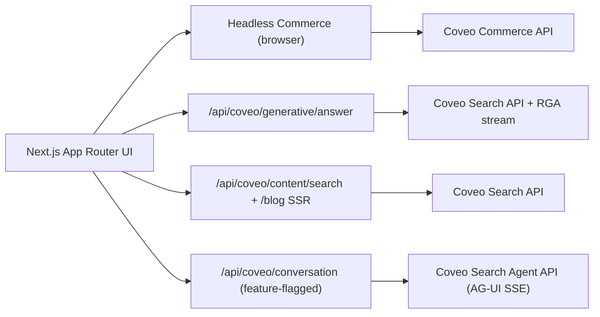

# RoboMotion Industries — Coveo Commerce Demo Narrative

> **Purpose.** This is the single, coherent story behind the demo: who RoboMotion is, the
> product-discovery problem this experience solves, what was built, how it is powered by Coveo,
> why Coveo beats a traditional storefront's native search, and where it goes next.
>
> **How to read it.** The business narrative comes first in each section for non-developer
> stakeholders. Deeper technical material is set off in **_Under the hood_** callouts that a
> non-technical reader can safely skip. Companion documents:
> [demo-script.md](demo-script.md) (timed talk-track), [interview-notes.md](interview-notes.md)
> (defensible Q&A), and the architecture diagrams in
> [outputs/architecture/](../outputs/architecture/README.md).

> **_Technical Marketing lens._** This deliverable is written the way Coveo's Technical Marketing
> team works: **transform complex technology into a compelling story backed by technical
> credibility, and connect every capability to a measurable business outcome.** It is deliberately
> built as a *repeatable enablement asset* — a story the field can reuse — not a one-off script.
> Three principles run through it: (1) lead with *why it matters*, then prove *how it works*;
> (2) every claim is traceable to real code or Coveo documentation — nothing is hand-waved;
> (3) limitations are stated plainly, because credibility is the product. The
> [interview panel section](#9-interview-panel--backgrounds-and-anticipated-questions) maps this
> story to the specific people who will evaluate it.

---

## Table of contents

1. [Opening narrative — RoboMotion and the industry problem](#1-opening-narrative)
2. [Demo walkthrough — the experience in action](#2-demo-walkthrough)
3. [Coveo Commerce capabilities — what, where, and how powered](#3-coveo-commerce-capabilities)
4. [Analytics — what is captured, why, and how it feeds relevance](#4-analytics)
5. [Competitive positioning — why Coveo, not native storefront search](#5-competitive-positioning)
6. [Value articulation — manufacturing-sector outcomes](#6-value-articulation)
7. [Implementation and architecture](#7-implementation-and-architecture)
8. [Future roadmap](#8-future-roadmap)
9. [Interview panel — backgrounds and anticipated questions](#9-interview-panel--backgrounds-and-anticipated-questions)

---

## 1. Opening narrative

### RoboMotion Industries

RoboMotion Industries is a fictitious industrial-robotics manufacturer and distributor. It sells
robot arms, end-effectors, sensors, controllers, and integration accessories into factories and
production lines. Its buyers are not casual shoppers — they are engineers and operators making
high-consequence equipment decisions where a wrong part means downtime, a failed integration, or a
safety incident.

That changes the nature of the search problem. RoboMotion's challenge is **product discovery**, not
keyword search. A buyer already knows roughly what they need; the job of the site is to help them
**narrow a large, technical catalog to a confident shortlist** — filtered by category, brand, price,
rating, and, above all, **confirmed compatibility with equipment they already own**.

### The four buyers and what they are actually trying to do

| Persona | The problem today | What they want to search / filter on |
| --- | --- | --- |
| **Manufacturing engineers** | Need fitment confidence before shortlisting. Generic keyword search returns plausible-looking parts that may not physically or electrically fit. | Compatibility with an existing robot series, technical specs, category-level narrowing. |
| **Plant managers** | Accountable for uptime and cost. Can't tell from a title whether an item is in stock or what it really costs. | Availability/stock, price and promo price, rating as a proxy for reliability. |
| **Systems integrators** | The core question is *"will this part work with the arm I already have?"* Traditional catalogs make them cross-reference spec sheets by hand. | **Compatible robot series** as a first-class filter — the single strongest story in this catalog. |
| **Procurement teams** | Must justify a shortlist to a budget and move it toward a quote. | Brand, price band, rating; a clear path to *Contact Sales* / *Request Quote*. |

### The thesis

Every persona above shares one need: **get from a broad catalog to a trustworthy shortlist quickly,
without losing compatibility and commercial context.** A keyword box cannot do that. A discovery
experience — faceted, ranked, self-service, and content-aware — can. That is what this demo shows.

---

## 2. Demo walkthrough

The build lives at `/catalog` (live product discovery), with `/blog` and `/blog/[id]` for technical
content and `/products/[id]` for a product detail page. For exact stage timing and speaker cues, use
[demo-script.md](demo-script.md); this section is the *narrative* of the walk.

1. **Search + query suggestions.** Type `wel`, watch commerce query suggestions appear, submit
   `welding arm`. The product path is **live Headless Commerce against the Coveo Commerce API** — not
   a mock. Show the result count and the product cards.
2. **Product cards.** Each card is a *domain* card, not a generic search result: price and promo
   price, rating, stock, brand, category, and **compatible robot series**. This is the buyer's
   decision surface.
3. **Facets.** Apply the five validated facets — Category, Compatible Robot Series, Brand, Price,
   Rating — and narrate the facet *types* (hierarchical / regular / numerical range). Compatible
   Robot Series is the fitment story made interactive.
4. **Pagination + sorting.** Show windowed pagination. Address sorting head-on: it is relevance-only
   because that is the only sort the Merchandising Hub interface config currently returns (verified
   against the live API). Frame it as a platform-config lever, not a gap.
5. **Comparison.** Select up to three products, open the comparison drawer. This is the "broad
   catalog → confident shortlist" moment: the buyer compares on the dimensions the catalog actually
   carries without losing commercial context.
6. **Product details + CTAs.** Open the details drawer: descriptions, images, compatibility fields,
   product URL, and **Contact Sales / Request Quote** actions (demo interactions until wired to a
   real CRM/commerce backend — say so).
7. **AI Product Guidance (RGA).** The generative answer banner gives grounded, cited guidance drawn
   from technical content. State the boundary clearly: **RGA explains and cites; it does not pick
   products.** It is not a recommendation engine.
8. **Technical Resources → article.** The right-rail resources use the Search API independently from
   Commerce. Click one to open its `/blog/[id]` article — full body, author/date/category/tags, and a
   "View original source" link.
9. **Conversational agent (optional, feature-flagged).** If `COVEO_FEATURE_CONVERSATION_ENABLED=true`
   for the run, open the floating chat widget. It is a *separate* Coveo integration (the Search Agent
   API, agentic RAG). **Warm it up before the demo** and avoid a cold ad-hoc question on stage — first
   retrieval can miss and a follow-up can take 15–25s to stream. See the timing caveat in
   [demo-script.md](demo-script.md).

**Failure isolation to point out while walking:** RGA, Technical Resources, and the chat widget each
fail independently and in-place. If any of them errors, **product discovery keeps working** — a
deliberate architectural property, not luck.

---

## 3. Coveo Commerce capabilities

This build uses **four distinct Coveo integrations**, each on its own failure boundary. The table
maps every capability to *where it lives in the app* and *how it is powered on the Coveo side*.

| Capability | Where it's wired in the app | How it's powered (Coveo backend) |
| --- | --- | --- |
| **Product discovery / search** | `useHeadlessCommerce` ([src/features/commerce/headless/use-headless-commerce.ts](../src/features/commerce/headless/use-headless-commerce.ts)), consumed by `ProductDiscoveryExperience`; header search box wired in on `/catalog` | Browser-side `@coveo/headless/commerce` controllers → **Coveo Commerce API**; Merchandising Hub interface config drives fields, facets, and sorts |
| **Query suggestions** | Header search box; `useGlobalSearchSuggestions` ([use-global-search-suggestions.ts](../src/features/commerce/headless/use-global-search-suggestions.ts)) on non-catalog pages | Commerce query-suggestion service (QS/PQS family) via Headless |
| **Facets** | `ProductFacetPanel`; fields defined in [commerce-config.ts](../src/features/commerce/config/commerce-config.ts) | Headless Commerce **facet generator**; facet types/values come from the Commerce interface config |
| **Pagination** | `Pagination` (windowed page numbers) | Headless Commerce pagination controller |
| **Sorting** | Results toolbar | `availableSorts` from the Commerce interface config (relevance-only today) |
| **Comparison** | `ComparisonBar` / `ComparisonDrawer` (local React state, up to 3) | App-side; operates on already-fetched Commerce product data |
| **Product details / PDP** | `ProductDetailsDrawer`; `/products/[id]` via `sessionStorage` hand-off | No extra Coveo call — renders already-fetched `ProductResult` |
| **RGA (AI Product Guidance)** | `GenerativeAnswer` banner → `/api/coveo/generative/answer` | **Coveo Search API + RGA** streaming endpoint (server route, `COVEO_PLATFORM_API_KEY`) |
| **Technical Resources / blogs** | `TrendingContent` rail → `/api/coveo/content/search`; `/blog` + `/blog/[id]` via [content-search.ts](../src/lib/coveo/content-search.ts) | **Coveo Search API** (server route + SSR) |
| **Conversational chatbot** | Global `ConversationalAgent` widget → `/api/coveo/conversation` (feature-flagged, off by default) | **Coveo Search Agent API** — agentic RAG over the AG-UI SSE protocol |
| **Analytics** | `AnalyticsProviderRoot` / `CoveoAnalyticsProvider` ([analytics.tsx](../src/features/analytics/analytics.tsx)); `trackingId: "robomotion"` | Coveo Commerce analytics (via Headless) + app-level UI event tracking |

> **_Under the hood — how it uses Coveo Headless and Coveo infra._**
> The product path is **browser-side Headless Commerce**, not a server-side search proxy. We use
> Coveo's own recommendation to prefer **controllers over raw REST calls** — `buildCommerceEngine`
> (organization-id only; endpoint resolution is automatic), then `buildSearch`, `buildSearchBox`,
> and the search/pagination/summary/sort/facetGenerator/didYouMean controllers. The three
> content/agent paths run **server-side only**, because they use the privileged
> `COVEO_PLATFORM_API_KEY` (and, for the agent, `COVEO_SEARCH_AGENT_ID`) that must never reach the
> browser. See [03-package-usage.md](../outputs/architecture/03-package-usage.md) and
> [02-high-level-architecture.md](../outputs/architecture/02-high-level-architecture.md).

### Machine learning models

Coveo Machine Learning for Commerce is a catalog of models, not a single black box
([Commerce models](https://docs.coveo.com/en/lacb0109/)). The table separates what this build
**leverages today** from what is **available in Coveo and on the roadmap** for RoboMotion.

| Coveo ML model | What it does | Status in this build |
| --- | --- | --- |
| **Query Suggestions (QS / Predictive QS)** | Commerce-tuned query completion | **Used** — surfaced through the Headless search box |
| **Automatic Relevance Tuning (ART)** | Self-learning ranking from usage analytics | **Used implicitly** — Commerce ranking improves as analytics accrue |
| **Relevance Generative Answering (RGA)** | Grounded, cited generative answers | **Used** — AI Product Guidance banner |
| **Conversational Product Discovery / Search Agent** | Conversational, agentic guidance toward a purchase | **Used** — feature-flagged chat widget |
| **Product Recommendations (PR)** | Analytics-driven suggestions by profile, context, behavior | **Roadmap** |
| **Session-Based Product Recommendations (SBPR)** | Real-time, in-session recommendations | **Roadmap** |
| **Intent-Aware Product Ranking (IAPR)** | Rank search results by shopping intent | **Roadmap** |
| **Search / Listing Page Optimizer (SPO / LPO)** | Rerank search and listing pages from aggregate behavior | **Roadmap** |
| **Dynamic Navigation Experience (DNE)** | Dynamically choose the most useful facets/values | **Roadmap** |
| **Catalog Semantic Encoder (CSE) / Multi-Modal Encoder** | Semantic (and text+image) product understanding | **Roadmap** |

> **Honest framing for the demo:** the models we *use today* are the ones a standard Commerce
> catalog + RGA + Search Agent light up out of the box. The recommendation, intent-ranking,
> page-optimizer, dynamic-navigation, and semantic-encoder models are all real Coveo capabilities we
> would turn on in a live engagement once analytics volume and data quality justify them — not
> invented features.

---

## 4. Analytics

Analytics is the engine that makes everything above get better over time. Two layers are captured:

- **Commerce analytics (via Headless Commerce):** searches, product clicks, facet selects, and page
  changes flow to Coveo automatically as part of the Commerce controllers, tagged with
  `trackingId: "robomotion"`.
- **App-level UI interactions (via the analytics provider):** the app additionally tracks the
  product-discovery moments that matter for this domain. The event vocabulary is explicit in
  [analytics.tsx](../src/features/analytics/analytics.tsx) — e.g. `search_submitted`,
  `query_suggestion_selected`, `facet_selected` / `facet_removed`, `sort_changed`, `page_changed`,
  `result_clicked`, `zero_results_displayed`, `product_compare_added` / `_removed` / `_opened`,
  `product_details_opened`, `contact_sales_clicked`, `request_quote_clicked`, plus RGA, trending, and
  conversation events.

**Why we capture it — and how it feeds relevance.** These signals are exactly the training data
Coveo's ML models consume:

- searches + clicks + zero-result events → **ART / SPO / LPO** ranking improvements;
- query submissions + suggestion selections → better **Query Suggestions**;
- facet usage → **Dynamic Navigation** decisions about which facets to surface;
- product clicks + (future) cart/quote events → **Product Recommendations** and **intent-aware
  ranking**.

In other words, the same events that let RoboMotion *measure* the funnel are what let Coveo
*optimize* it. Discovery gets more relevant the more the catalog is used.

> **_Under the hood — the security rule._** The analytics layer must **never** send tokens, raw
> Coveo payloads, or privileged credentials. It emits named events with small, sanitized payloads
> (empty/undefined values are filtered out). This keeps analytics useful without leaking anything
> that belongs server-side.

---

## 5. Competitive positioning

When walking the demo, this is *why introduce Coveo rather than lean on a storefront platform's
native search (Shopify, BigCommerce, or a traditional keyword engine)*:

- **Discovery, not just a search box.** Native storefront search is largely keyword matching over a
  product table. Coveo delivers ranked, faceted, self-learning discovery designed for large,
  technical catalogs.
- **Self-learning relevance.** ART/SPO/LPO continuously re-rank from real behavior. Native search
  ranking is typically static rules and manual boosts that someone has to hand-maintain.
- **Unified products *and* content.** Coveo searches the product catalog (Commerce API) *and*
  technical content/blogs (Search API) as first-class, separately-governed domains. Storefront search
  rarely reaches documentation, spec content, or knowledge articles.
- **AI self-service built in.** RGA (grounded, cited answers) and the agentic Search Agent give
  buyers guidance and conversational help — capabilities a storefront platform would need bolt-on
  third-party tools to approximate.
- **Compatibility-aware faceting.** A `compatible_robot_series` facet turns fitment from a manual
  spec-sheet chore into one click — the exact decision criterion these buyers care about most.
- **Headless composability.** Coveo Headless powers a bespoke, domain-specific buying UI without
  forcing the experience into a template — while the ranking, ML, and analytics run on Coveo's
  managed infrastructure.

The one-liner: **a storefront's native search helps you *find a product you can name*; Coveo helps a
manufacturing buyer *decide with confidence* — and gets smarter every time someone uses it.**

---

## 6. Value articulation

Tying the capabilities back to manufacturing-sector outcomes:

| Outcome | How the demo delivers it | Who benefits most |
| --- | --- | --- |
| **Faster product discovery** | Query suggestions + relevance ranking + five decision-grade facets narrow a large catalog in seconds | All personas |
| **Clearer product comparison** | Side-by-side comparison of up to three products keeps commercial + compatibility context together | Procurement, engineers |
| **Improved self-service** | RGA guidance, technical resources, and the conversational agent answer questions without a sales call | Engineers, integrators |
| **Stronger confidence in selection** | Compatible-robot-series faceting + ratings + stock + specs reduce the risk of a wrong-fit purchase | Integrators, engineers |
| **Path to conversion** | Contact Sales / Request Quote turn a confident shortlist into a sales motion | Procurement, plant managers |

Net effect: **shorter time-to-shortlist, fewer wrong-fit purchases, more deflected support
questions, and a cleaner hand-off to the sales/quote process** — with a relevance engine that
improves as usage grows.

---

## 7. Implementation and architecture

### The four integration paths

The product path is **browser-side Headless Commerce**. Server routes exist only for credentials that
must stay off the client (search-token minting, RGA, content search, the conversational agent). Full
diagram: [02-high-level-architecture.md](../outputs/architecture/02-high-level-architecture.md).

### Major decision — Headless over Atomic (and Headless over raw REST)

Coveo offers three approaches to a product-discovery UI
([Approaches for building product discovery interfaces](https://docs.coveo.com/en/o6q90192/)):

| Approach | Flexibility | Effort | Fit here |
| --- | --- | --- | --- |
| **Raw Commerce/Search REST APIs** | Highest | Highest | Overkill — Coveo itself recommends *against* this for most builds |
| **Headless** | High (full UI control) | Medium | **Chosen** — controllers over raw fetches, developer-friendly |
| **Atomic** | Lower (pre-built components) | Lowest | Not chosen — see below |

Why **Headless** for RoboMotion:

- **Atomic is built *on top of* Headless** — "Atomic relies on the Coveo Headless library to
  interface with Coveo and handle application state." Choosing Headless keeps the exact same engine,
  ranking, and analytics, and gives full control over the UI.
- This is a **domain buying workflow** — custom product cards with compatibility fields, local
  comparison, a details drawer, RGA, and a technical-resources rail — not a standard search page
  Atomic's prebuilt components express well.
- **Accessibility.** Atomic is currently open beta without a formal accessibility review; a bespoke,
  a11y-conscious buying UI is safer built directly on Headless.
- Coveo **strongly recommends Headless over raw REST** — exactly the boundary this repo enforces
  (controllers, not hand-rolled fetches). See [interview-notes.md](interview-notes.md) for the full
  Q&A version.

Products use the **Commerce API**; technical resources and RGA grounding use the **Search API** —
kept separate on purpose so product ranking, analytics, and buyer expectations don't blur with
document content.

### Auth and security

- **Anonymous assessment mode** (the validated demo path): the browser uses
  `NEXT_PUBLIC_COVEO_ANONYMOUS_SEARCH_API_KEY` with Headless Commerce.
- **Secured production mode:** set `COVEO_AUTH_MODE=search-token`; the browser calls
  `/api/search-token`, which mints short-lived tokens server-side from
  `COVEO_AUTHENTICATED_SEARCH_API_KEY`, bound to the signed-in identity.
- **No credential fallback** between modes — a deliberate choice so behavior is never ambiguous.
- **`COVEO_PLATFORM_API_KEY` is server-only** and never exposed through any `NEXT_PUBLIC_` variable;
  it powers RGA, content search, and the conversational agent inside server routes only.

See [06-authentication-flow.md](../outputs/architecture/06-authentication-flow.md).

### Scalability defense

Coveo owns the hard-to-scale parts — indexing, ranking, ML, and query throughput — on managed
infrastructure. The app stays a **thin, controller-driven UI**. The real scaling work in a live
engagement is therefore not front-end performance; it is **data quality and governance**: normalized
attributes, consistent field population, identity, analytics dashboards, and operational monitoring.
Keeping the UI small and the platform responsible for search is what makes this scale.

---

## 8. Future roadmap

Grouped by the discipline that owns each item. Everything below is explicitly **not yet wired in this
build**; the ML items map to real Coveo models named in [§3](#3-coveo-commerce-capabilities).

**Data model (prerequisite for most of the rest)**

- Add structured manufacturing specifications to the index as facetable fields: payload, reach,
  precision, mounting, certifications, controller compatibility.
- Validate source data — naming, type, nullability, localization — *before* exposing any field as a
  buyer decision criterion.

**Auth**

- Identity-aware secured search: bind minted tokens to the signed-in user and security provider;
  renew through `/api/search-token`.

**Commerce**

- Configure `availableSorts` for `ec_price` / `ec_rating` field sorting on the listing config.
- Wire **Product Recommendations (PR)** and **Session-Based Recommendations (SBPR)** placements.
- Production CTA integrations: connect Contact Sales / Request Quote to real CRM/commerce systems.

**Merchandising**

- Turn on **Search Page Optimizer / Listing Page Optimizer (SPO/LPO)** and **Intent-Aware Product
  Ranking (IAPR)**; add merchandising rules and boosts in the Merchandising Hub.
- Enable **Dynamic Navigation (DNE)** so facets adapt to query and behavior.

**Analytics**

- Stand up dashboards on the events already captured; add cart/quote conversion events to close the
  loop for recommendation and intent models.

**SEO**

- Server-rendered, indexable catalog/listing pages and structured data for products, so discovery
  works from organic search, not just on-site.

**Machine learning**

- **Catalog Semantic Encoder (CSE)** and the **Multi-Modal Catalog Encoder** for semantic and
  text+image discovery of descriptive, natural-language queries.
- Grow **ART** and **Query Suggestions** quality as analytics volume increases.

---

---

## 9. Interview panel — backgrounds and anticipated questions

Four people will evaluate this demo, each through a different lens. A Technical Marketing story
succeeds when it lands with *all four at once* — the CMO's narrative, the PM's product truth, the
Technical Marketing craft, and the SE's sell. This section pictures each background, what they are
really evaluating, and the questions they are most likely to ask, with a short prepared answer and a
pointer to where the full version lives.

### Panelist-to-section map

| Panelist | Primary lens | Sections that speak to them |
| --- | --- | --- |
| **Pranshu Tewari** — Chief Marketing Officer | Story, differentiation, measurable outcomes | [§1](#1-opening-narrative), [§5](#5-competitive-positioning), [§6](#6-value-articulation) |
| **Olivier Tetu** — Manager, Product Management | Capability accuracy, roadmap credibility, data model | [§3](#3-coveo-commerce-capabilities), [§4](#4-analytics), [§8](#8-future-roadmap) |
| **Simon Black** — Director, Technical Marketing | Storytelling craft, credibility, repeatable enablement | [§2](#2-demo-walkthrough), [§7](#7-implementation-and-architecture), whole doc structure |
| **Karan Hunjan** — Sales Engineer | Objection handling, live-demo reliability, sales impact | [§2](#2-demo-walkthrough), [§5](#5-competitive-positioning), demo-script timing caveats |

---

### Pranshu Tewari — Chief Marketing Officer

**Background & lens.** Owns Coveo's market narrative and brand. He is not here to read code; he is
here to judge whether this is a *story that sells* — clear, differentiated, and tied to business
outcomes. He thinks in positioning, audience, and measurable impact.

**Likely questions & prepared answers:**

- *"Give me the one-sentence story."* → "A storefront's search helps you find a product you can name;
  Coveo helps a manufacturing buyer **decide with confidence** — and gets smarter every time someone
  uses it." (See [§1 thesis](#1-opening-narrative), [§5 one-liner](#5-competitive-positioning).)
- *"How is this different from what a prospect already has?"* → Discovery vs. keyword matching,
  self-learning relevance, unified products **and** content, built-in AI self-service, and
  compatibility-aware faceting. ([§5](#5-competitive-positioning).)
- *"What business outcomes does it drive?"* → Shorter time-to-shortlist, fewer wrong-fit purchases,
  more deflected support questions, cleaner sales hand-off — with relevance that compounds as usage
  grows. ([§6](#6-value-articulation).)
- *"Why manufacturing robotics?"* → It makes the discovery problem vivid: the buyer's real question
  is fitment ("will this work with the arm I own?"), which a keyword box cannot answer but a
  `compatible_robot_series` facet can.
- *"Could the field reuse this?"* → Yes — it is written as a repeatable enablement asset: swap the
  catalog and personas, keep the structure.

---

### Olivier Tetu — Manager, Product Management

**Background & lens.** Owns product truth. He will probe for accuracy and honesty: what is *actually*
live vs. mocked, whether the roadmap is credible, and whether the data-model reasoning is sound. The
fastest way to lose him is to overclaim.

**Likely questions & prepared answers:**

- *"What's live vs. mocked here?"* → Live: product search, suggestions, facets, pagination, RGA,
  content/blogs, and (flagged) the Search Agent — all against real Coveo APIs. Demo-only: the
  Contact Sales / Request Quote CTAs and local comparison state. Stated plainly in
  [§2](#2-demo-walkthrough) and [§3](#3-coveo-commerce-capabilities).
- *"Why relevance-only sorting — is that a gap?"* → It is a config lever, not a gap. `availableSorts`
  from the Merchandising Hub interface config returns only relevance today; I verified that against
  the live API rather than assuming. `ec_price` / `ec_rating` sorting is a config change on the
  listing config. ([§8 Commerce](#8-future-roadmap), [interview-notes.md](interview-notes.md).)
- *"Why isn't RGA recommending products?"* → RGA is grounded in content, not a validated
  recommendation strategy. Presenting it as product selection would be misleading. Product
  recommendation is a separate Coveo model family (PR/SBPR). ([§3 ML table](#3-coveo-commerce-capabilities).)
- *"What ML would you turn on, and in what order?"* → Data model first (structured specs), then
  ranking/merchandising (SPO/LPO/IAPR/DNE), then recommendations (PR/SBPR), then semantic encoders
  (CSE/Multi-Modal) — each mapped to real Coveo models. ([§8](#8-future-roadmap).)
- *"How did you choose the facets?"* → Not in the UI — I validated which fields are actually indexed
  and facetable against the live API, then exposed those: category, compatible robot series, brand,
  price, rating. ([interview-notes.md](interview-notes.md).)

---

### Simon Black — Director, Technical Marketing

**Background & lens.** The likely hiring manager for this role. He evaluates the *craft*: does the
story build confidence through technical proof, is it consistent, is it repeatable, and is the
technical depth pitched correctly for a mixed audience? He is looking for someone who can turn
innovation into assets the whole company reuses.

**Likely questions & prepared answers:**

- *"How would you turn this into a repeatable field asset?"* → It already is one: a layered doc
  (business-first, technical callouts), a timed [demo-script.md](demo-script.md), a defensible
  [interview-notes.md](interview-notes.md), and maintained architecture diagrams. From here it forks
  into a blog, a video walkthrough, and a reference architecture with no rewrite.
- *"How do you balance depth with a non-technical audience?"* → Lead with why-it-matters, then set
  technical proof off in skippable **_Under the hood_** callouts so a CMO and an SE read the same
  document at different depths.
- *"How do you keep it credible?"* → Every claim traces to real code (files/routes/facets) or Coveo
  docs, and limitations are stated as design choices, not apologies. Credibility is the deliverable.
- *"What's the live-demo risk and how do you de-risk it?"* → The Search Agent's first retrieval can
  miss and a follow-up can take 15–25s to stream, so I warm up the thread before the demo and never
  take a cold ad-hoc question on stage. The isolated-failure architecture also means RGA/resources/
  chat can fail without breaking product discovery. ([demo-script.md](demo-script.md) timing caveat,
  [§2](#2-demo-walkthrough).)
- *"Show me the architecture in 30 seconds."* → Four independent Coveo integration paths, product
  search browser-side, everything privileged server-side. ([§7](#7-implementation-and-architecture).)

---

### Karan Hunjan — Sales Engineer

**Background & lens.** Lives in live demos and prospect objections. He cares whether this *sells* —
whether it survives a skeptical buyer, handles the "we already have search" objection, and shortens a
cycle. He will pressure-test reliability and the competitive story.

**Likely questions & prepared answers:**

- *"A prospect says 'we already have Shopify/BigCommerce search — why Coveo?'"* → Native storefront
  search is keyword matching with manual boosts; Coveo is self-learning discovery across products
  **and** content, with AI self-service and compatibility faceting the platform can't express.
  ([§5](#5-competitive-positioning).)
- *"'Isn't this just search? Our platform does that.'"* → Show the fitment facet and the comparison
  drawer — decision support, not lookup — then RGA answering a technical question with citations.
  That is the gap native search can't close.
- *"What breaks live, and what's your fallback?"* → The conversational agent's latency is the one
  risk; I warm it up and keep a known-good question ready. Everything else fails in isolation, so
  the core product-discovery flow is always demoable.
- *"Give me the 5-minute version for a busy buyer."* → It exists: search → facets → compare → RGA →
  architecture/auth close. ([demo-script.md 5-minute version](demo-script.md).)
- *"How does this shorten my sales cycle?"* → Self-service discovery + guidance qualifies the buyer
  before a call, and the Contact Sales / Request Quote path hands you a shortlist that is already
  narrowed on compatibility, price, and rating.

---

*Sources for Coveo capability and model claims:*
[Commerce ML models](https://docs.coveo.com/en/lacb0109/) ·
[Approaches for building product discovery interfaces](https://docs.coveo.com/en/o6q90192/) ·
in-repo architecture snapshot at [outputs/architecture/](../outputs/architecture/README.md).
