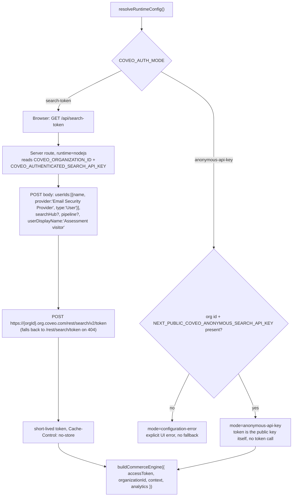
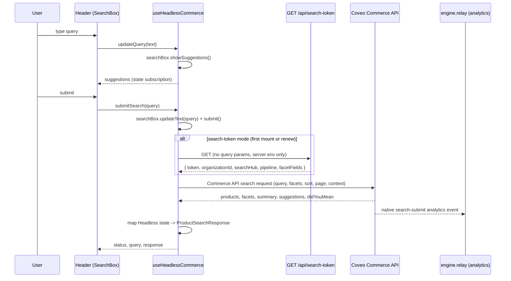

# 1. Search & Query Suggestions

Two engines exist side by side, both built from `@coveo/headless/commerce`:

- **`useHeadlessCommerce`** (`src/features/commerce/headless/use-headless-commerce.ts`) — the full
  product-search engine (search, facets, sort, pagination, did-you-mean). Powers `/catalog` and,
  once mounted, `Header`'s search box on that route only (via `usePublishHeaderSearch`).
- **`useGlobalSearchSuggestions`** (`src/features/commerce/headless/use-global-search-suggestions.ts`)
  — a lighter engine (search box + suggestions only, no facets/pagination). Powers `Header`'s
  default search mode on every other route (`/`, `/blog`, `/blog/[id]`, `/products/[id]`), which
  submits by navigating to `/catalog?q=...` rather than searching in place.

Both are Headless SDK controllers, not raw fetch calls — there is no server-side search proxy for
product search. See [`06-authentication-flow.md`](../../outputs/architecture/06-authentication-flow.md)
and [`08-search-facet-interaction-flow.md`](../../outputs/architecture/08-search-facet-interaction-flow.md)
for the underlying detail this file summarizes.

## Authorization

Auth mode is resolved once, server-side, from `COVEO_AUTH_MODE`:



- `NEXT_PUBLIC_COVEO_ANONYMOUS_SEARCH_API_KEY` is intentionally browser-visible (assessment-only
  mode). `COVEO_AUTHENTICATED_SEARCH_API_KEY` never leaves the server and is only read inside
  `/api/search-token`.
- The engine's `renewAccessToken` callback re-calls `/api/search-token` transparently when the
  Headless SDK needs a fresh token — the browser never sees the raw API key in either mode beyond
  the anonymous key itself.
- There is no fallback between modes; misconfiguration is a visible error state, not a silent
  downgrade.

## Payloads

**Token mint request** (`/api/search-token` → Coveo):

```json
{
  "userIds": [{ "name": "anonymous", "provider": "Email Security Provider", "type": "User" }],
  "searchHub": "<optional COVEO_SEARCH_HUB>",
  "pipeline": "<optional COVEO_PIPELINE>",
  "userDisplayName": "Assessment visitor"
}
```

**Token mint response** (`/api/search-token` → browser):

```json
{
  "token": "<short-lived token>",
  "organizationId": "...",
  "searchHub": "",
  "pipeline": "",
  "facetFields": ["source", "filetype"]
}
```

**Commerce engine construction** (`createCommerceControllers`, browser-side):

```ts
buildCommerceEngine({
  configuration: {
    accessToken, organizationId,
    analytics: { enabled: true, trackingId: COMMERCE_DEFAULTS.trackingId },
    context: { country, currency, language, view: { url: viewUrl } },
    ...(renewAccessToken ? { renewAccessToken } : {}),
  },
});
```

The Headless SDK builds and sends the actual Commerce API search request itself (no manual JSON
body is constructed in app code) — the request carries the query text, active facet selections,
sort criterion, page, and the `context`/`analytics` block above.

Query suggestions: `searchBox.showSuggestions()` triggers the same engine's suggestion request;
the UI never builds a suggestions payload itself. `waitForSuggestions()`
(`use-headless-commerce.ts`) subscribes to `searchBox.state.suggestions`, with a 900ms timeout
fallback (`SUGGESTION_WAIT_TIMEOUT_MS`).

## Front end ↔ Coveo communication

- Package: `@coveo/headless` (`^3.53.1`), `@coveo/headless/commerce` entry point.
- No manual `fetch` to a Coveo search endpoint anywhere in product search — `buildCommerceEngine`
  resolves the Commerce API endpoint automatically from `organizationId` and issues requests
  itself over HTTPS.
- `@coveo/relay-event-types` supplies the `CurrencyCodeISO4217` type used to type the commerce
  `context.currency` value; it does not add any runtime call.
- The engine's `Relay` client (`engine.relay`) is the same channel Headless uses for its own
  native analytics, and is reused by `CoveoAnalyticsProvider` (see below) to emit custom events.

## Analytics

- `analytics: { enabled: true, trackingId }` on `buildCommerceEngine` makes the Headless Commerce
  engine natively log search-submit, facet-select, sort, and pagination events to Coveo's Event
  stream — no app code constructs these.
- `CoveoAnalyticsProvider` (`src/features/analytics/analytics.tsx`) attaches to `engine.relay`
  (`analytics.attachRelay(bundle.engine.relay)` in `use-headless-commerce.ts`) and forwards
  app-level events that have no native Headless equivalent — e.g. `product_compare_added`,
  `product_details_opened`, `contact_sales_clicked` — as `relay.emit("robomotion/<eventName>", {
  ...payload, timestamp })`, landing in the same Event stream so they can feed ML/ART alongside
  native events.
- Events queue in `CoveoAnalyticsProvider` until a relay is attached (engine not yet built) and
  flush once it is.
- `trackProductClick(productId)` calls the Headless-native `search.interactiveProduct({ options: {
  product } }).select()` — the canonical Commerce click/select analytics action — rather than a
  custom event.
- `ConsoleAnalyticsProvider` is a `console.info` no-op double used where a real relay isn't
  available (e.g. the conversational agent's own analytics root); `NoopAnalyticsProvider` backs
  disabled analytics.

## Sequence diagram


