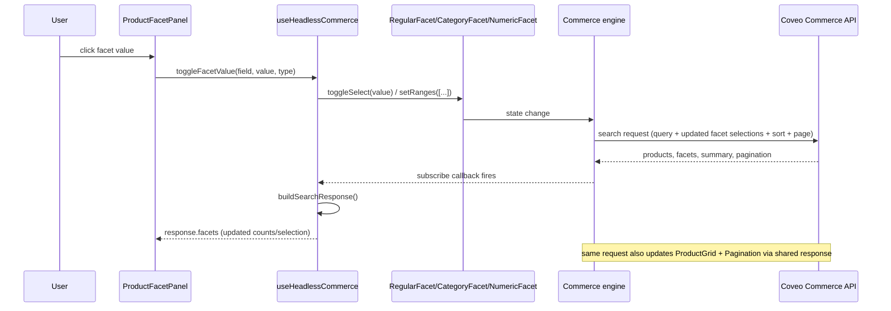

# 2. Catalog / Product Listing Page

`/catalog` renders `ProductDiscoveryExperience`, a client component tree wired entirely to one
`useHeadlessCommerce` bundle (`src/features/commerce/headless/use-headless-commerce.ts`). There is
no server-rendered product data and no product-search API route — the browser talks to Coveo's
Commerce API directly through the Headless SDK. See
[`04-product-discovery-component-communication.md`](../../outputs/architecture/04-product-discovery-component-communication.md),
[`05-headless-commerce-controller-lifecycle.md`](../../outputs/architecture/05-headless-commerce-controller-lifecycle.md),
and [`07-product-search-state-flow.md`](../../outputs/architecture/07-product-search-state-flow.md).

## Load sequence, starting from auth

```mermaid
sequenceDiagram
  participant UI as ProductDiscoveryExperience
  participant Hook as useHeadlessCommerce
  participant Auth as resolveCommerceAuth
  participant Token as GET /api/search-token
  participant Engine as Commerce engine (browser)
  participant Coveo as Coveo Commerce API

  UI->>Hook: mount (authConfig, initialQuery="welding arm")
  Hook->>Auth: resolve auth
  alt anonymous-api-key
    Auth-->>Hook: organizationId + public access token
  else search-token
    Auth->>Token: GET
    Token-->>Auth: token, organizationId, renewAccessToken()
  else configuration-error
    Auth-->>Hook: throw
    Hook-->>UI: status=error (no engine built)
  end

  Hook->>Engine: buildCommerceEngine({ accessToken, organizationId, context, analytics:{enabled:true} })
  Hook->>Engine: buildSearch(engine); buildSearchBox(engine)
  Hook->>Engine: search.pagination({ pageSize: COMMERCE_DEFAULTS.perPage })
  Hook->>Engine: search.summary(); search.sort({criterion: relevance})
  Hook->>Engine: search.facetGenerator(); search.didYouMean()
  Hook->>Engine: engine.subscribe(onStateChange)
  Hook->>Engine: searchBox.updateText(initialQuery)
  Hook->>Engine: searchBox.submit()
  Engine->>Coveo: search request (query, empty facets, default sort, page 0)
  Coveo-->>Engine: products, facets, summary, pagination, sort options
  Engine-->>Hook: state change notification
  Hook->>Hook: buildSearchResponse() maps controller state -> ProductSearchResponse
  Hook-->>UI: { status, query, response }
```

Controllers created in `createCommerceControllers()`: `buildCommerceEngine`, `buildSearch`,
`buildSearchBox`, `search.pagination()`, `search.summary()`, `search.sort()` (initial criterion:
`buildRelevanceSortCriterion()`), `search.facetGenerator()`, `search.didYouMean()`. All are stored
in a ref so UI event handlers call controller actions without rebuilding the engine.

## Auth

Same as [search flow](01-search-and-suggestions.md#authorization): `search-token` mode fetches
`GET /api/search-token` once per engine build (and again transparently via `renewAccessToken` when
the SDK needs a fresh token); `anonymous-api-key` mode uses
`NEXT_PUBLIC_COVEO_ANONYMOUS_SEARCH_API_KEY` directly as the engine's `accessToken`, no network
round trip. No per-request token is attached manually — it's baked into the engine at
construction time.

## Payload / calls per interaction

All of these are Headless controller method calls, not hand-built HTTP requests — the SDK
constructs and sends the Commerce API request:

| User action | Code path | Controller call |
| --- | --- | --- |
| Load page | `useHeadlessCommerce` mount effect | `searchBox.updateText(initial)` → `searchBox.submit()` |
| Type in search box | `SearchBox` → `commerce.updateQuery` | `searchBox.updateText(query)` |
| Query suggestions | `suggestionsProvider.getSuggestions` | `searchBox.showSuggestions()`, read `searchBox.state.suggestions` |
| Submit search | `commerce.submitSearch` | `searchBox.updateText(trimmed)` → `searchBox.submit()` |
| Toggle regular/hierarchical facet value | `toggleFacetValue()` | `RegularFacet.toggleSelect(value)` / `CategoryFacet.toggleSelect(value)` |
| Set numeric/price range (dynamic facet) | `toggleRange()` | `NumericFacet.setRanges([{ start, end, endInclusive:true, state:'selected' }])` |
| Clear one facet | `clearFacet(field)` | iterate `facetGenerator.facets`, call `.deselectAll()` on the match |
| Clear all filters | `clearAllFacets()` | `facetGenerator.deselectAll()` |
| Change sort | `updateSort(sortId)` | find matching criterion in `sort.state.availableSorts`, call `sort.sortBy(criterion)` |
| Select page | `selectPage(page)` | `pagination.selectPage(Math.max(0, page))`, windowed by `getPageWindow()` in `Pagination.tsx` |
| Retry after error | `retry()` | re-`searchBox.submit()` if engine exists, else re-run the init effect (rebuild engine + re-fetch token) |
| Click a product (analytics) | `trackProductClick(productId)` | `search.interactiveProduct({ options: { product } }).select()` |

Every one of these mutates engine state and re-triggers a Commerce API search request under the
hood — there's a single request/response cycle per state change, not separate calls per facet
type.

## Facet calls

Facets are not fetched separately from the product list. `search.facetGenerator()` returns
`RegularFacet | CategoryFacet | NumericFacet` controllers whose values/counts arrive as part of
the same search response as the product list; toggling one issues the same kind of request as a
query change, now including the updated facet selection state.

## Product details / sort / pagination

- **Product details**: clicking a `ProductResultCard` tile/title does not call Coveo again. The
  card already holds the full `ProductResult` from the list response; it writes that object to
  `sessionStorage["pdp-product:<id>"]` via `storeProductForPdp()`
  (`src/lib/commerce/product-session-cache.ts`) and opens `/products/<id>` in a new tab with
  `window.open()`. The `/products/[id]` server shell performs no fetch; `ProductDetailClient`
  reads the same-origin `sessionStorage` entry to render. "Quick View" instead opens an in-page
  `ProductDetailsDrawer` from React-owned state — also no new Coveo call. **There is no
  product-detail API route or Coveo call in this path.**
- **Sort**: `search.sort()` is initialized with `buildRelevanceSortCriterion()`. If more than one
  criterion is configured, the UI exposes `commerce.updateSort(id)`; otherwise it renders a
  read-only "Relevance" label.
- **Pagination**: `search.pagination({ options: { pageSize: COMMERCE_DEFAULTS.perPage } })`.
  `Pagination.tsx` computes a windowed page-button set (`getPageWindow`, always showing page 1,
  last page, and a `siblingCount`-wide window around current, collapsing gaps to `"…"`) rather than
  rendering one button per page; it renders `null` when `totalPages <= 1`.

## Packages / APIs used

- `@coveo/headless` (`^3.53.1`) — `@coveo/headless/commerce` controllers, all product/facet/
  sort/pagination logic.
- `@coveo/relay-event-types` — typing for the commerce `context.currency` field only.
- `lucide-react` — facet/sort/pagination icons.
- No REST call is hand-authored for product search; the only app-owned HTTP call in this flow is
  `GET /api/search-token` (search-token auth mode only).

## Analytics

Same relay-based model as [search flow](01-search-and-suggestions.md#analytics):

- Native Headless analytics (`analytics.enabled: true`) covers search submit, facet select/remove,
  sort change, and pagination automatically via `engine.relay`.
- `CoveoAnalyticsProvider` forwards app-level events with no native equivalent —
  `product_compare_added` / `_removed` / `_opened`, `product_details_opened`,
  `contact_sales_clicked`, `request_quote_clicked` — onto the same relay as
  `robomotion/<eventName>`.
- Product click/select uses the Headless-native `interactiveProduct(...).select()` action, not a
  custom event, so it's attributable in Coveo's own commerce analytics model.

## Sequence diagram: facet toggle → new result set


