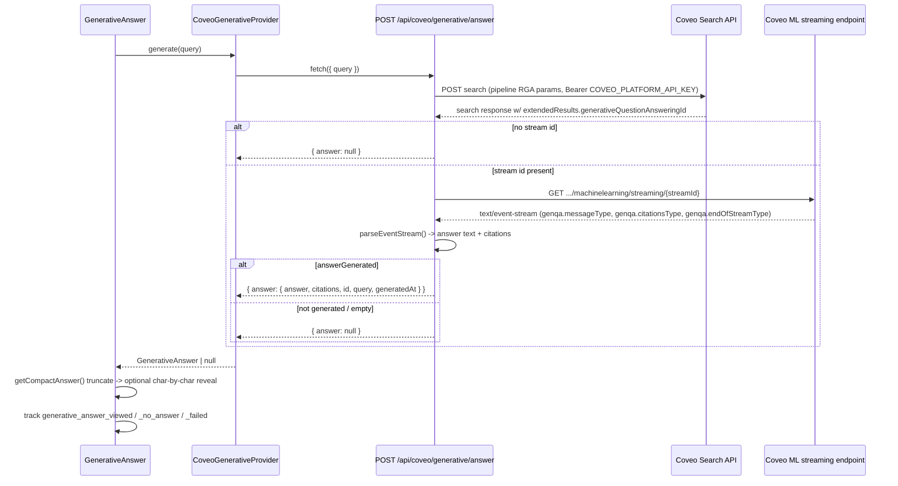

# 3. Generative Answer (RGA)

`GenerativeAnswer` renders as a banner above the results toolbar in `ProductDiscoveryExperience`
(`/catalog` only) — it is not part of the Headless Commerce controller state and fails/loads
independently of the product grid. See
[`09-generative-answer-banner-flow.md`](../../outputs/architecture/09-generative-answer-banner-flow.md).

## Auth

- Server-only route: `POST /api/coveo/generative/answer`
  (`src/app/api/coveo/generative/answer/route.ts`, `runtime = "nodejs"`).
- Credential: `COVEO_PLATFORM_API_KEY`, read via `requiredServerEnv()` — never sent to the browser.
- Target: Coveo **Search API** (`COVEO_SEARCH_API_BASE_URL`, `platform-eu.cloud.coveo.com/rest/search/v2`
  family), the same base URL/credential used by content search — a different Coveo resource family
  than the Search Agent API used by the chat widget.

## Payload

**Browser → `/api/coveo/generative/answer`:**

```json
{ "query": "<current catalog query>" }
```

**Route → Coveo Search API** (step 1, gets a stream id):

```json
{
  "q": "<query>",
  "firstResult": 0,
  "numberOfResults": 10,
  "locale": "en",
  "pipeline": "<COVEO_RGA_PIPELINE or COVEO_PIPELINE>",
  "searchHub": "<getSearchHub(COVEO_RGA_SEARCH_HUB, COVEO_SEARCH_HUB)>",
  "pipelineRuleParameters": {
    "mlGenerativeQuestionAnswering": {
      "citationsFieldToInclude": ["source", "filetype"],
      "responseFormat": { "contentFormat": ["text/plain"] }
    }
  }
}
```

**Route → Coveo** (step 2, once a `generativeQuestionAnsweringId` stream id comes back in the
search response's `extendedResults`):

```
GET {platformOrigin}/rest/organizations/{orgId}/machinelearning/streaming/{streamId}
Accept: text/event-stream
```

**Route → browser** (final JSON, after parsing the SSE stream server-side):

```json
{ "answer": { "answer": "...", "citations": [...], "generatedAt": "...", "id": "<streamId>", "query": "..." } }
```

or `{ "answer": null }` when no stream id or no answer was generated, or `{ "error": "..." }` on
upstream failure. The browser never sees the raw upstream SSE frames for this flow — the route
buffers and re-emits one JSON object.

## Front end ↔ Coveo communication

- `GenerativeAnswer` → `CoveoGenerativeProvider.generate(query)` → `fetch POST
  /api/coveo/generative/answer` (same-origin, no Coveo credential visible client-side).
- The route itself makes two server-to-server calls to Coveo: a search POST to get a stream id,
  then a GET on the machine-learning streaming endpoint to read the actual generated text/event
  stream (`event: genqa.messageType` text deltas, `genqa.citationsType` citations,
  `genqa.endOfStreamType` completion marker) via `parseEventStream()`.
- Answer text is truncated client-side to a ~280-char, ~2-sentence preview
  (`getCompactAnswer()`), then optionally revealed character-by-character (3 chars/20ms) if
  `featureFlags.enableGenerativeStreaming` is on — this is a local `setInterval` animation over an
  already-fetched string, not real token streaming from Coveo for this flow (contrast with the
  chat widget, which does stream token-by-token).
- A per-effect `isCurrent` closure flag guards against a stale double-mount fetch dispatching after
  a newer one has already resolved.

## Packages

- No Coveo SDK is used for this route — it's hand-authored `fetch` calls from a Next.js Route
  Handler, using `src/lib/coveo/server-api.ts` helpers (`COVEO_SEARCH_API_BASE_URL`,
  `withOrganizationId`, `requiredServerEnv`, `optionalServerEnv`, `getSearchHub`).
- Client-side: no extra package — a plain `fetch` inside `CoveoGenerativeProvider`.

## Analytics

- Tracked client-side by `GenerativeAnswer`/`GenerativeAnswerContent` via the app's own analytics
  context (not the Headless Commerce relay, since this isn't a Headless controller): events include
  `generative_answer_requested`, `generative_answer_viewed`, `generative_answer_failed`,
  `generative_no_answer`, `generative_citation_clicked`, `generative_feedback_submitted`
  (`AnalyticsEventName` in `src/features/analytics/analytics.tsx`).
- These are app-level `ConsoleAnalyticsProvider`/`CoveoAnalyticsProvider` events, distinct from the
  Headless engine's native search analytics used by the catalog flow.

## Sequence diagram


