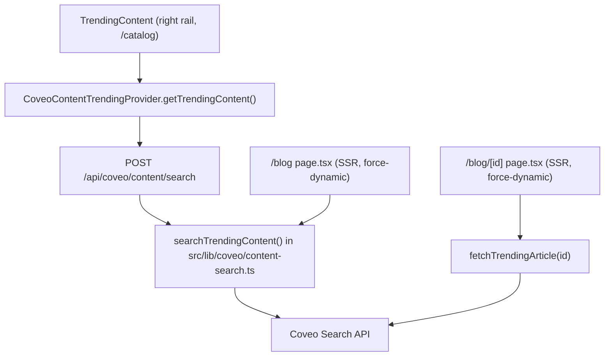
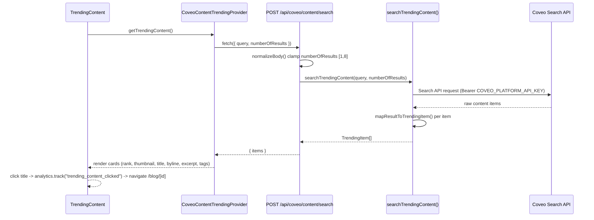
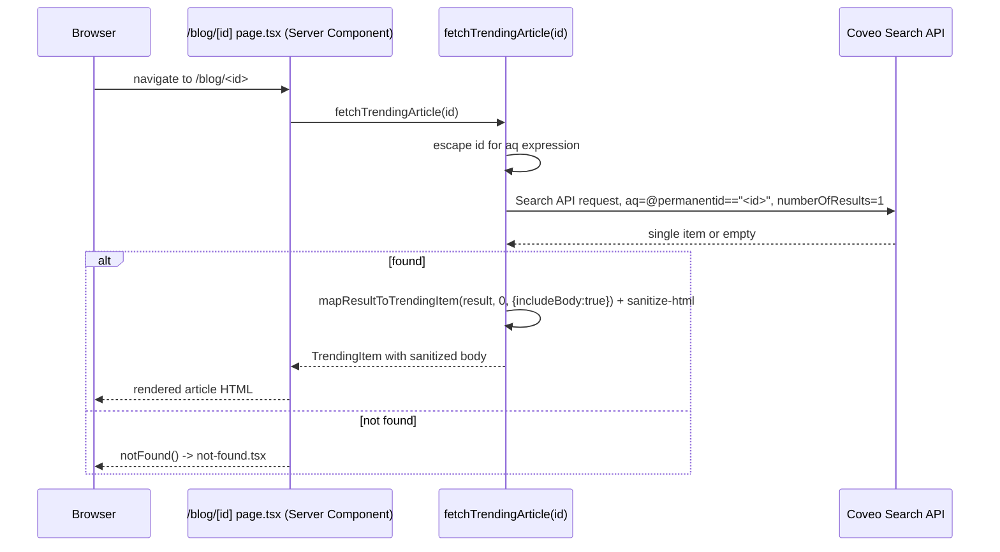

# 4. Content Search (Trending Rail + Blog)

Three surfaces share the same server-side content-search logic
(`src/lib/coveo/content-search.ts`), but reach it two different ways:

- **Trending Content rail** (`ProductRightRail` on `/catalog`) goes through an API route.
- **`/blog` index** and **`/blog/[id]` article** pages call the same library functions directly,
  server-to-server, with no HTTP hop through an API route.

See [`10-trending-content-and-article-flow.md`](../../outputs/architecture/10-trending-content-and-article-flow.md).

## Auth

- Credential: `COVEO_PLATFORM_API_KEY`, server-only, same credential and same Search API base URL
  as the Generative Answer route — read via `requiredServerEnv()`/`server-api.ts` helpers, never
  exposed to the browser or a `NEXT_PUBLIC_` variable.
- `/blog` and `/blog/[id]` are Server Components with `export const dynamic = "force-dynamic"`,
  so the Coveo call happens fresh on every request during SSR — there is no client-side auth step
  for these two pages' content.
- The Trending rail's route, `POST /api/coveo/content/search`, is a Next.js Route Handler
  (`runtime = "nodejs"`) called from the browser but authenticating to Coveo itself server-side —
  the browser never sees `COVEO_PLATFORM_API_KEY`.

## Payloads

**Browser → `/api/coveo/content/search`** (Trending rail only):

```json
{ "query": "robotics", "numberOfResults": 4 }
```

`numberOfResults` is clamped server-side to `[1, 8]`, default `4`; `query` defaults to `"robotics"`
if omitted/blank.

**Route/library → Coveo Search API** (`searchTrendingContent(query, numberOfResults)`):
a Search API query scoped to content items, executed with `COVEO_PLATFORM_API_KEY`.

**Route → browser response:**

```json
{ "items": [ { "id": "...", "title": "...", "author": "...", "category": "...", "imageUrl": "...", "publishedAt": "...", "tags": ["..."], "wordCount": 0, "reason": "..." } ] }
```

or `{ "error": "Technical resources could not be loaded." }` (502, upstream failure — a
`CoveoContentRequestError`) / `{ "error": "Technical resources are not configured." }` (500, e.g.
missing env).

**Single article fetch** (`fetchTrendingArticle(id)`, used by `/blog/[id]`, no route hop):

```
aq: '@permanentid=="<escaped id>"'
numberOfResults: 1
```

The `id` comes from a client-controlled route param and is escaped (backslash/quote escaping)
before interpolation into the `aq` expression. The result is mapped with
`mapResultToTrendingItem(result, 0, { includeBody: true })` — the `includeBody` flag is what
triggers HTML sanitization of `raw.content`/`raw.body` (see Packages, below); list-view calls never
set it.

**Blog index fetch** (`/blog/page.tsx`): `searchTrendingContent("robotics", 12)`, same mapping,
`includeBody: false`.

## Front end ↔ Coveo communication



- Card `raw` field mapping (`mapResultToTrendingItem`): `author`, `category`, `imageUrl`
  (`raw.featured_image_url`), `publishedAt` (`raw.date`/`raw.created_date`), `tags`
  (`raw.tags`, semicolon-split), `wordCount` (`raw.word_count`), `body` only when `includeBody`.
- No match on `/blog/[id]` calls `notFound()` → `not-found.tsx`.

## Packages / APIs used

- `sanitize-html` (`^2.17.6`) — server-side only, inside `fetchTrendingArticle()`. Cleans the raw
  `content`/`body` HTML (restrictive allow-list) before it's rendered via
  `dangerouslySetInnerHTML` on `/blog/[id]`, and forces external body links to
  `rel="noopener noreferrer" target="_blank"`.
- No Coveo SDK — this is hand-authored `fetch` against the Search API, same helper module
  (`src/lib/coveo/server-api.ts`) as the Generative Answer route.

## Analytics

- Trending card title click on `/catalog`: `analytics.track("trending_content_clicked", ...)`.
- `/blog` index card links: no analytics event.
- Article page "View original source" external link (`BlogArticleActions`): tracked via its own
  `AnalyticsProviderRoot` + `ConsoleAnalyticsProvider` instance (mounted standalone since
  `/blog/[id]` sits outside the catalog's analytics tree) as `trending_source_visited` /
  `trending_article_opened`-style events from the `AnalyticsEventName` union.
- Empty/error states render user-facing copy ("No articles are available right now." /
  "Blog articles could not be loaded.") without surfacing raw Coveo error detail; no separate
  analytics event is fired for these states in this flow (contrast with product search, which has
  a dedicated `zero_results_displayed` event).

## Sequence diagram: trending rail (client-triggered)



## Sequence diagram: article page (server-rendered, no route hop)


