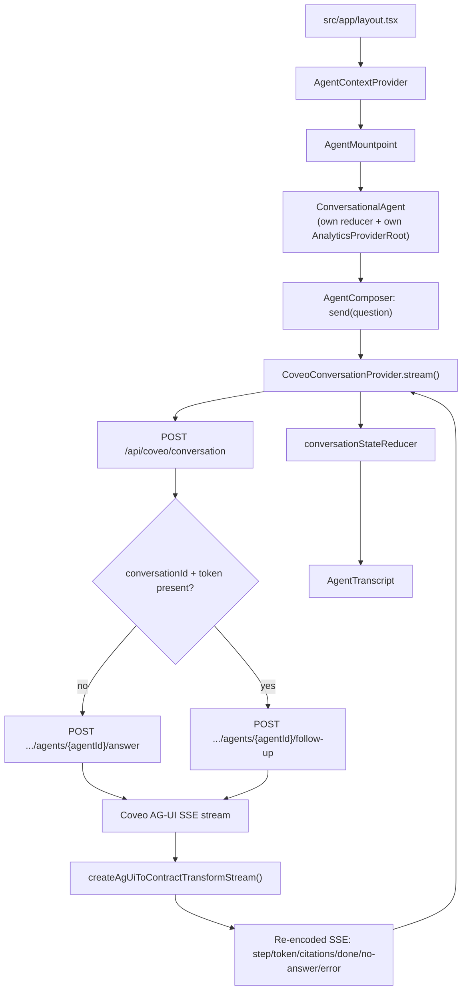

# 5. Conversational Agent (Chat Widget)

A floating "Ask RoboMotion" launcher + drawer, mounted globally in `src/app/layout.tsx` as a
sibling of every route's page content (not owned by any one page), gated behind the
`conversation.enabled` feature flag (off by default) and rendering nothing when disabled. It talks
to Coveo's **Search Agent API** — an agentic-RAG service, protocol- and host-distinct from the
Search API used by product search / RGA / content search. See
[`15-conversational-agent-flow.md`](../../outputs/architecture/15-conversational-agent-flow.md).

## Protocol

- Transport: HTTPS POST from the browser to same-origin `/api/coveo/conversation`; that route then
  POSTs to Coveo and streams the response back as re-encoded Server-Sent Events (`Content-Type:
  text/event-stream`).
- Upstream Coveo protocol: **AG-UI** over SSE (`RUN_STARTED`, `CUSTOM` frames for `header`/
  `citations`, `STEP_STARTED`/`STEP_FINISHED`, `TEXT_MESSAGE_CHUNK`, `RUN_FINISHED`, `RUN_ERROR`).
  The route never forwards raw AG-UI frames to the browser — `createAgUiToContractTransformStream()`
  (`src/lib/coveo/ag-ui-stream.ts`) buffers `\n\n`-delimited SSE blocks and re-emits a smaller,
  stable contract (see table below).
- Multi-turn state (`conversationId` + `conversationToken`) is opaque and browser-held
  (`ConversationSession`, in the widget's reducer state), not a server session — every turn is a
  fresh HTTP request that either starts or continues a thread depending on whether both values are
  present.

## Auth

- Server-only route: `POST /api/coveo/conversation` (`route.ts`, `runtime = "nodejs"`,
  `dynamic = "force-dynamic"`).
- Credentials: `COVEO_PLATFORM_API_KEY` (same server-only key as RGA/content search) +
  `COVEO_SEARCH_AGENT_ID`, both read via `requiredServerEnv()`/`getSearchAgentId()`, never sent to
  the browser.
- URL built by `getSearchAgentHeadAnswerUrl()` / `getSearchAgentFollowUpUrl()`
  (`src/lib/coveo/search-agent-api.ts`) from `COVEO_ORGANIZATION_ID` + agent id — a distinct host/
  path family (`{orgId}.org.coveo.com/api/v1/organizations/{orgId}/agents/{agentId}/...`) from the
  `platform-eu.cloud.coveo.com/rest/search/v2` family used elsewhere.

## Payload

**Browser → `/api/coveo/conversation`:**

```json
{ "q": "<question, trimmed & capped at 300 chars>", "pageContext": { "path": "...", "kind": "catalog|product|article|blog|home", "id": "...", "title": "...", "query": "..." }, "conversationId": "<optional>", "conversationToken": "<optional>" }
```

- `pageContext` gives the agent product/article/catalog awareness of where the question was asked
  from. `ProductDetailClient` (PDP) and `BlogArticleActions` (article) explicitly publish it via
  `usePublishPageContext()`; every other route falls back to a pathname-derived default
  (`deriveDefaultKind()`).

**Route → Coveo** — endpoint choice depends on whether both `conversationId` and
`conversationToken` are present:

- **Head turn** (first message / after reset): `POST .../agents/{agentId}/answer`, body `{ "q": "..." }`.
- **Follow-up turn**: `POST .../agents/{agentId}/follow-up`, body `{ "conversationId": "...", "conversationToken": "...", "q": "..." }`.

Both requests send `Authorization: Bearer <COVEO_PLATFORM_API_KEY>` and
`Accept: text/event-stream, application/json`.

**Route → browser re-encoded SSE contract:**

| Outgoing event | Source AG-UI frame | Payload |
| --- | --- | --- |
| `step` | `STEP_STARTED` (known `stepName`: Searching/Thinking/Answering) | `{ stepName }` |
| `token` | `TEXT_MESSAGE_CHUNK` | `{ delta }` |
| `citations` | `CUSTOM` citations frame, de-duplicated by id | `{ citations: GenerativeCitation[] }` |
| `done` | `RUN_FINISHED`, `completionReason === "ANSWERED"` | `{ answerGenerated: true, conversationId, conversationToken }` |
| `no-answer` | `RUN_FINISHED`, other completion reason | `{ conversationId, conversationToken }` |
| `error` | `RUN_ERROR` | `{ message }` |

The conversation thread stays open across a `no-answer` turn — the next question in the same
session is still sent as a follow-up, not a new head turn.

## Communication with Coveo (architecture)



## Packages

- `react-markdown` (`^10.1.0`) — client-side only, in `AgentMessage.tsx`, renders assistant answer
  text (Search Agent returns `contentFormat: text/markdown`). No `rehype-raw` plugin, so raw HTML
  in source text never renders — inherently XSS-safe by omission, not by sanitization. Answer
  links are additionally hardened via a custom `a` renderer to `rel="noreferrer"
  target="_blank"`.
- No Coveo SDK — hand-authored `fetch`/`ReadableStream` handling both server-side (route) and
  client-side (`CoveoConversationProvider`).
- `MockConversationProvider` exists as a fixture-only test double (word-by-word streaming, no
  network); it implements the same interface but is never wired into the running app —
  `AgentMountpoint` always constructs `CoveoConversationProvider`.

## Analytics

- The widget mounts its **own** `AnalyticsProviderRoot` + `ConsoleAnalyticsProvider` instance
  (mirroring `BlogArticleActions`), since it lives outside any single page's analytics tree.
- Tracked events: `conversation_message_sent`, `conversation_answer_viewed`,
  `conversation_answer_failed`.
- Citations reuse the same `GenerativeCitation` model and the same `generative_citation_clicked`
  event as the RGA banner's citations, whether linking internally to `/blog/[permanentId]` or
  externally via `getSafeCitationUrl()`.
- This is console-only analytics in the current build (no relay), distinct from the Headless
  Commerce engine's native relay-based analytics used by product search.

## Sequence diagram

```mermaid
sequenceDiagram
  participant U as User
  participant Composer as AgentComposer
  participant Widget as ConversationalAgent (reducer)
  participant Provider as CoveoConversationProvider
  participant Route as POST /api/coveo/conversation
  participant Agent as Coveo Search Agent API

  U->>Composer: type question, press Enter
  Composer->>Widget: send(question)
  Widget->>Widget: dispatch "sent" (append user msg + streaming placeholder)
  Widget->>Provider: stream({ q, pageContext, conversationId?, conversationToken?, signal })
  Provider->>Route: fetch POST { q, pageContext, conversationId?, conversationToken? }
  Route->>Route: choose head vs follow-up turn
  alt head turn
    Route->>Agent: POST .../agents/{agentId}/answer { q }
  else follow-up turn
    Route->>Agent: POST .../agents/{agentId}/follow-up { conversationId, conversationToken, q }
  end
  Agent-->>Route: AG-UI SSE stream (RUN_STARTED, STEP_*, TEXT_MESSAGE_CHUNK, CUSTOM citations, RUN_FINISHED)
  Route->>Route: createAgUiToContractTransformStream()
  Route-->>Provider: re-encoded SSE (step/token/citations/done|no-answer/error)
  loop per SSE block
    Provider->>Widget: onStep / onToken / onCitations
    Widget->>Widget: dispatch "step"/"token"/"citations"
  end
  Provider-->>Widget: resolve { status: answered|no-answer, session }
  Widget->>Widget: dispatch "done"/"no-answer"; track conversation_answer_viewed
  Widget-->>U: rendered markdown answer + AgentCitations
```
