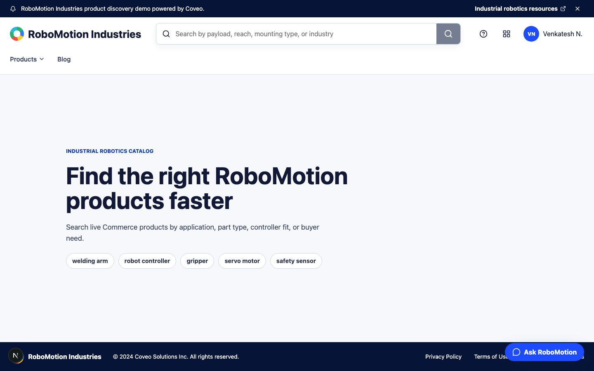
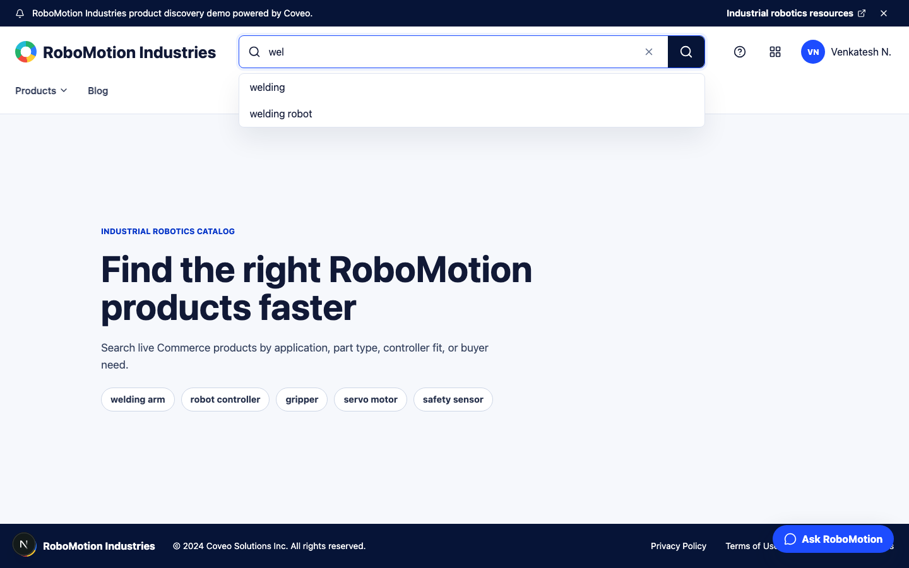
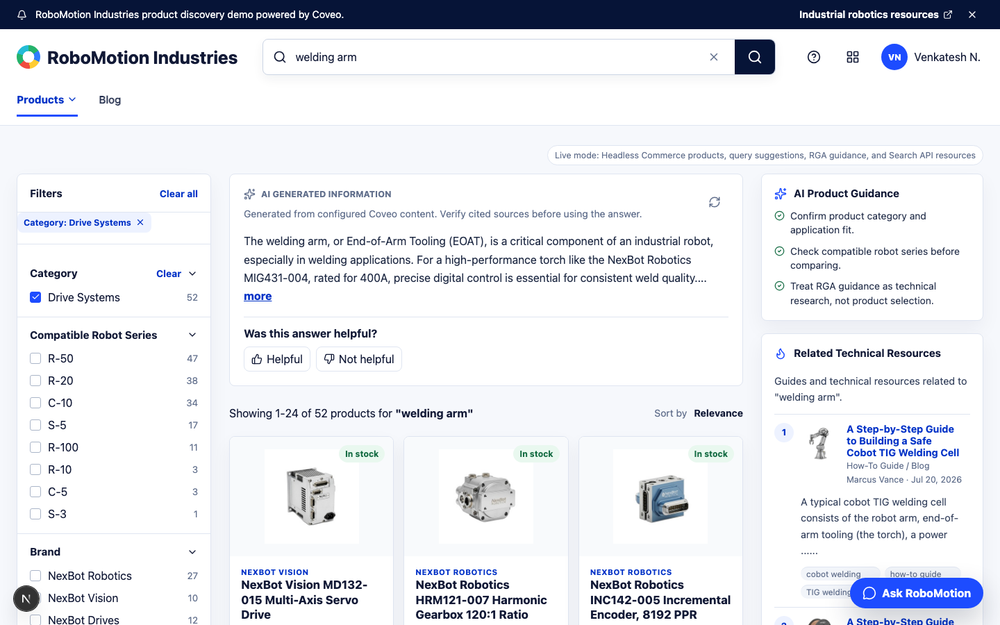
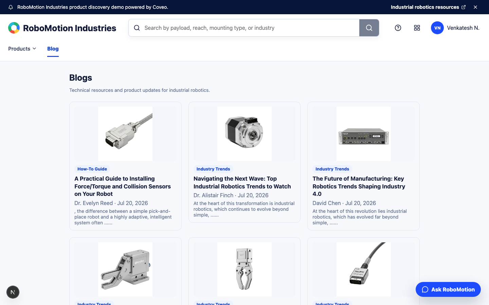
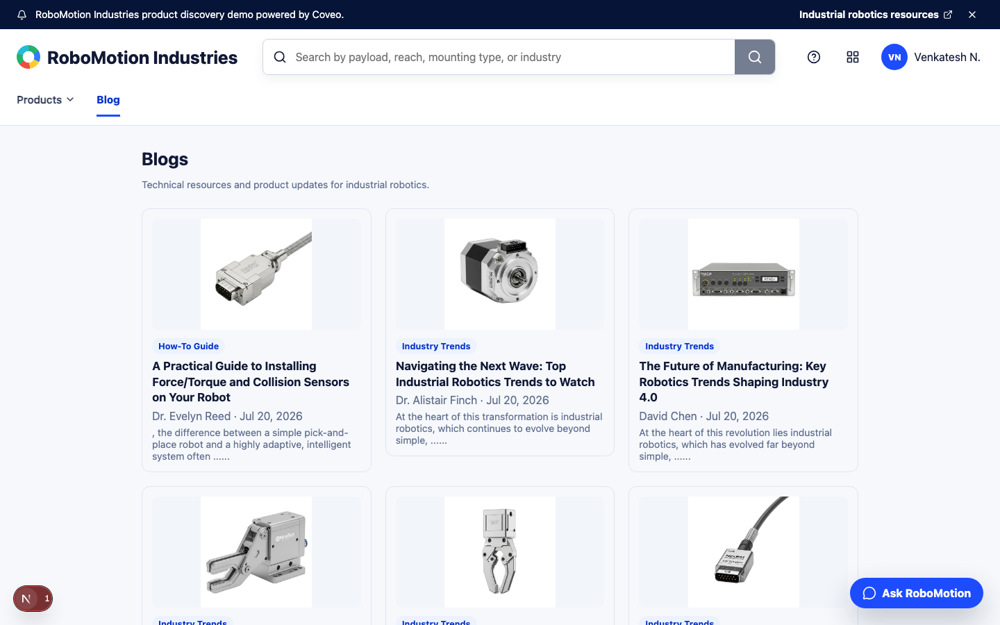
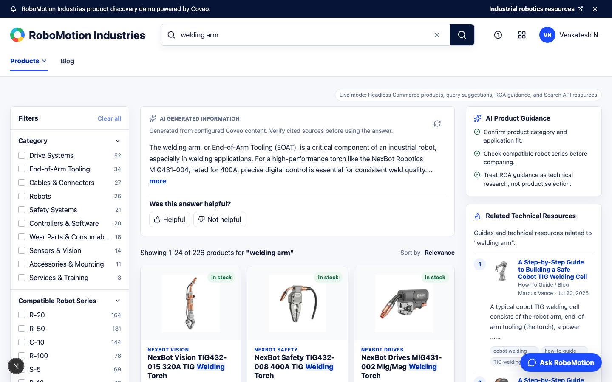
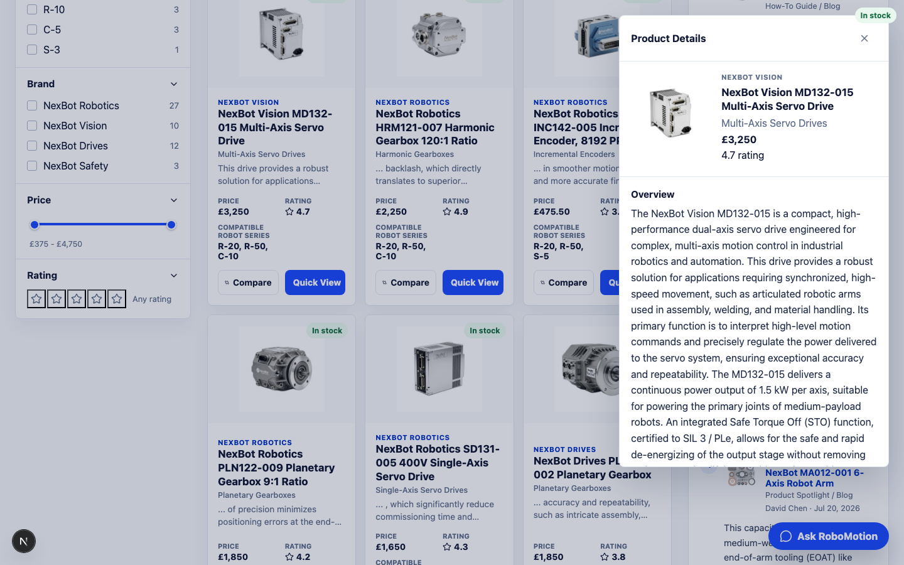
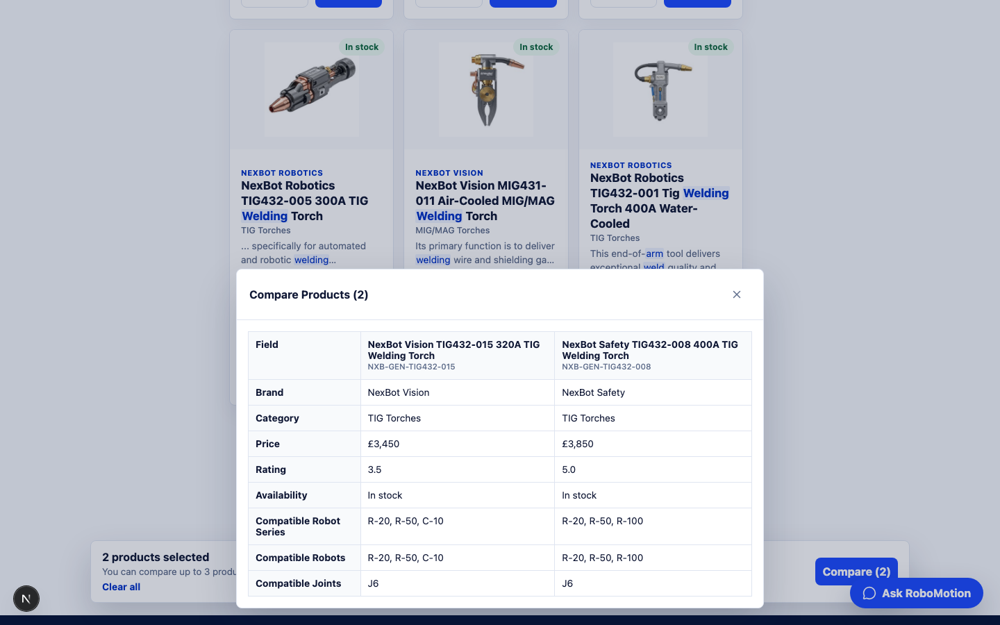
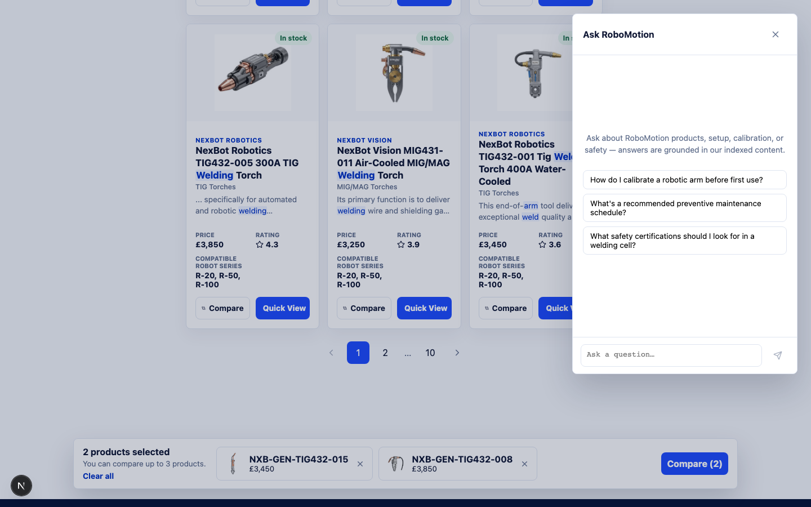

# UI Screenshots

Reference screenshots of every documented page and interaction state, captured against a live Coveo org (Headless Commerce, RGA, trending content, and the Conversational Search Agent all enabled). Regenerate with:

```
npm run docs:screenshots
```

This requires a dev server already running at `http://localhost:3000` (`npm run dev`) and a working `.env.local`. The capture script lives at [scripts/capture-screenshots.mjs](../scripts/capture-screenshots.mjs) and writes PNGs into `docs/screenshots/`.

## Home — empty search



## Search suggestions



## Catalog page


## Generative Answer


## Facets toggle



## Blog

Index:



Detail:



## Trending Content



## Quick View



## Compare Products



## Chat bot opened


